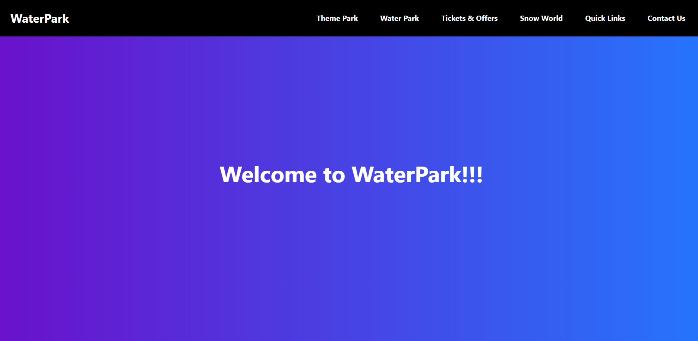
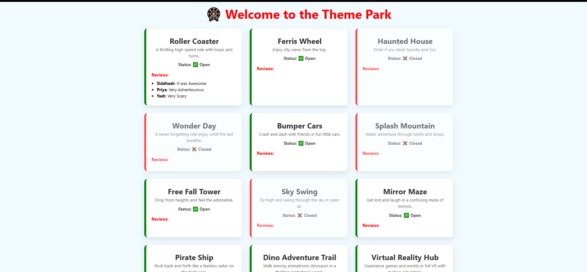
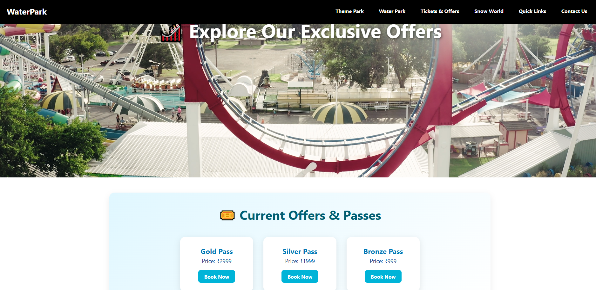

# 🏝️ WaterPark Booking System

A Full-Stack Web Application to Explore, Book & Manage Tickets for a WaterPark & Theme Park. Built with **React**, **Node.js**, **Express**, and **PostgreSQL**, this Project brings Modern Booking Systems to Life with Vibrant UI & Interactive Features.









## 💻 Tech Stack

- **Frontend:** React, HTML5, CSS3
- **Backend:** Node.js, Express.js
- **Database:** PostgreSQL
- **Version Control:** Git & GitHub

## ⚙️ Getting Started

Backend Setup

```bash
cd server
npm install
node index.js

Frontend Setup
cd client
npm install
npm start