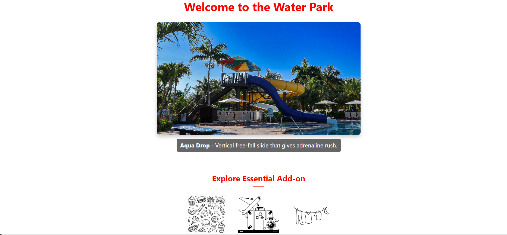

# 🏝️ WaterPark Booking System

A Dynamic Full-Stack Web Application built to Simplify & Enhance the Experience of Exploring, Booking & Managing Tickets for both WaterPark & Theme Park Attractions. This project Integrates the Power of React for a Seamless user Interface, Node.js & Express.js for a Robust Backend & PostgreSQL for Secure, Scalable Data Handling.
From Selecting Exclusive passes like Gold, Silver & Bronze, to Real-time Booking Confirmations — the App delivers a Modern, User-friendly Solution to Traditional Park Ticketing.
Whether you're Booking for a Family getaway or a Thrill-seeking Adventure, this System Offers:

🎟️ Real-Time Offer Listings
🧾 Interactive Booking Forms with Validation
📧 Email & Contact Management System
🔄 Live Feedback & Booking Confirmations
🛠️ Secure PostgreSQL Database Integration

With a Clean UI, Responsive Layout & Real-time Interactions, the WaterPark Booking System Blends Functionality with Fun - Turning a Typical Ticket Booking into a Smooth Digital Experience.





## 💻 Tech Stack

- **Frontend:** React, HTML5, CSS3
- **Backend:** Node.js, Express.js
- **Database:** PostgreSQL
- **Version Control:** Git & GitHub

## ⚙️ Getting Started

Backend Setup

```bash
cd server
npm install
node index.js

Frontend Setup
cd client
npm install
npm start